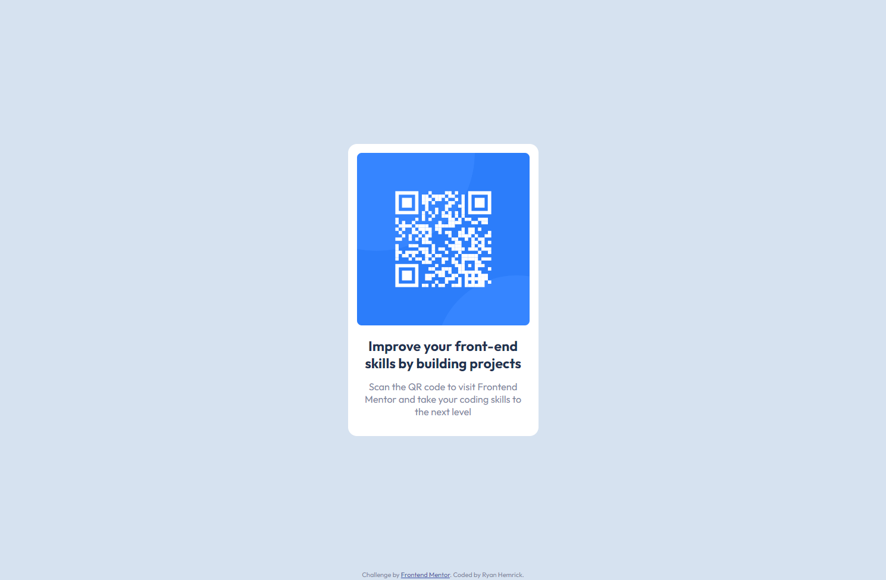

# Frontend Mentor - QR code component solution

This is a solution to the [QR code component challenge on Frontend Mentor](https://www.frontendmentor.io/challenges/qr-code-component-iux_sIO_H). Frontend Mentor challenges help you improve your coding skills by building realistic projects. 

## Table of contents

- [Overview](#overview)
  - [Screenshot](#screenshot)
  - [Links](#links)
- [My process](#my-process)
  - [Built with](#built-with)
  - [What I learned](#what-i-learned)
  - [Continued development](#continued-development)
- [Author](#author)

## Overview
- A static QR code component built with basic HTML and CSS

### Screenshot

### Links
- Live Site URL: https://aquamarine-mandazi-86f16b.netlify.app/

## My process
- Utilized Flexbox on the "body" element to vertically and horizontally center the QR code wrapper
- Used custom properties (for the first time) to set colors and font-family
- Referenced design JPG images for spacing and sizing reference

### Built with
- Semantic HTML5 markup
- CSS custom properties
- Flexbox

### What I learned
- With this small project, I wanted to practice using flexbox for the layout and use custom properties for the first time

### Continued development
- HTML could be more semantic/descriptive. Could refactor any pixel values to rem units; I do want to study up on the benefits and use cases of relative units over pixels.

## Author
- Ryan Hemrick
